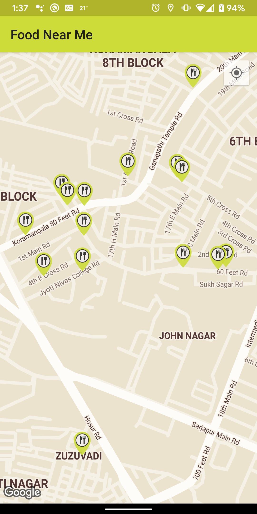
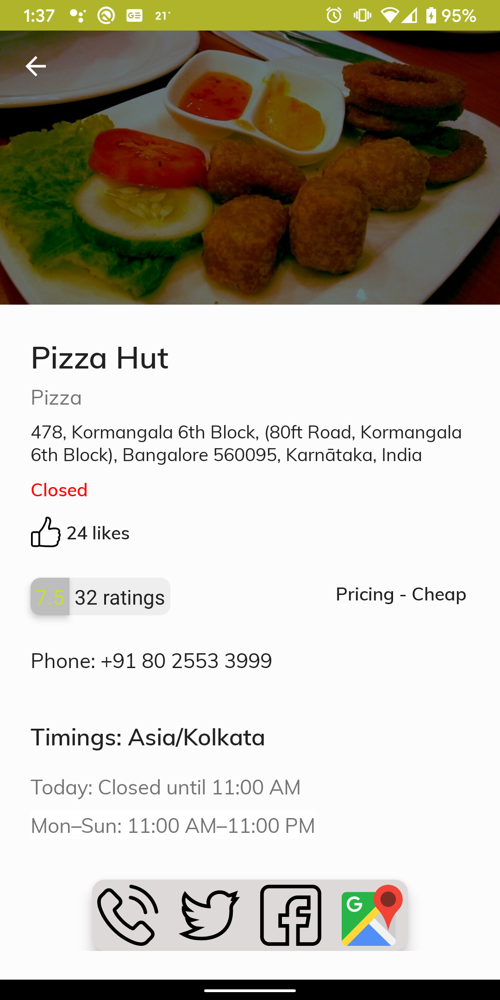

# foodnearme
Using Foursquare api to view nearby restaurants

 

The app is built using MVVM. Third party libraries used are:

1. Google Maps SDK
2. RxJava2
3. Dagger2
4. Retrofit
5. OkHttp
6. Picasso
7. Architecture Components - LiveData, ViewModel
8. Mockito